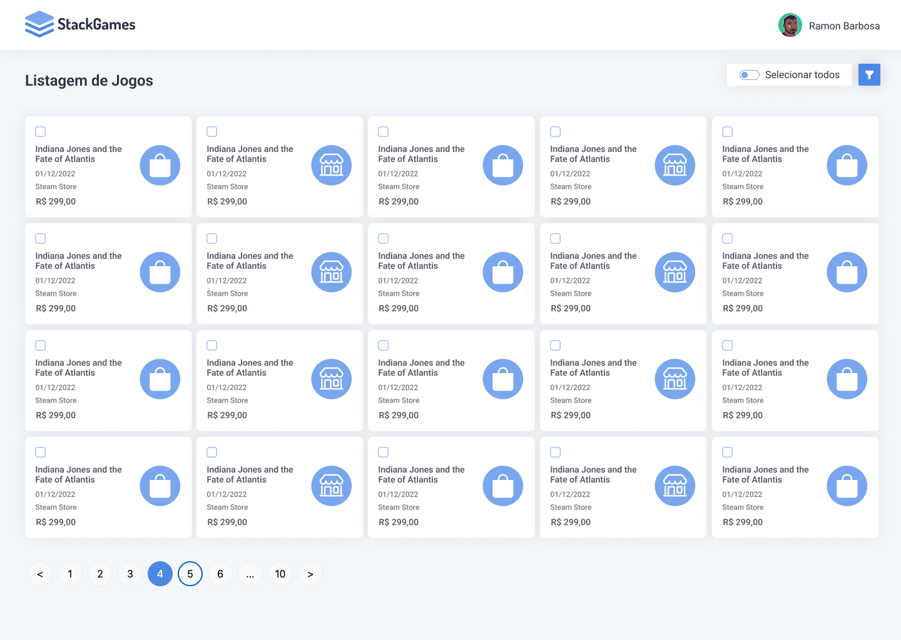

# pulcher-code-desafio

This template should help get you started developing with Vue 3 in

## Recommended IDE Setup

[VSCode](https://code.visualstudio.com/) + [Volar](https://marketplace.visualstudio.com/items?itemName=Vue.volar) (and disable Vetur) + [TypeScript Vue Plugin (Volar)](https://marketplace.visualstudio.com/items?itemName=Vue.vscode-typescript-vue-plugin).

## Type Support for `.vue` Imports in TS

TypeScript cannot handle type information for `.vue` imports by default, so we replace the `tsc` CLI with `vue-tsc` for type checking. In editors, we need [TypeScript Vue Plugin (Volar)](https://marketplace.visualstudio.com/items?itemName=Vue.vscode-typescript-vue-plugin) to make the TypeScript language service aware of `.vue` types.

If the standalone TypeScript plugin doesn't feel fast enough to you, Volar has also implemented a [Take Over Mode](https://github.com/johnsoncodehk/volar/discussions/471#discussioncomment-1361669) that is more performant. You can enable it by the following steps:

1. Disable the built-in TypeScript Extension
    1) Run `Extensions: Show Built-in Extensions` from VSCode's command palette
    2) Find `TypeScript and JavaScript Language Features`, right click and select `Disable (Workspace)`
2. Reload the VSCode window by running `Developer: Reload Window` from the command palette.

## Customize configuration

See [Vite Configuration Reference](https://vitejs.dev/config/).

## Project Setup

```sh
npm install
```

### Compile and Hot-Reload for Development

```sh
npm run dev
```

### Type-Check, Compile and Minify for Production

```sh
npm run build
```

### Run Unit Tests with [Vitest](https://vitest.dev/)

```sh
npm run test:unit
```

### Run End-to-End Tests with [Cypress](https://www.cypress.io/)

```sh
npm run test:e2e:dev
```

This runs the end-to-end tests against the Vite development server.
It is much faster than the production build.

But it's still recommended to test the production build with `test:e2e` before deploying (e.g. in CI environments):

```sh
npm run build
npm run test:e2e
```

### Lint with [ESLint](https://eslint.org/)

```sh
npm run lint
```


<h1 align="center">
    
</h1>

<p align="center">
 <a href="#-sobre-o-projeto">Sobre</a> •
 <a href="#-funcionalidades">Funcionalidades</a> •
 <a href="#-layout">Layout</a> • 
 <a href="#-como-executar-o-projeto">Como executar</a> • 
 <a href="#-tecnologias">Tecnologias</a> •  
 <a href="#-autor">Autor</a> • 
 <a href="#user-content--licença">Licença</a>
</p>


## 💻 Sobre o projeto

Stack Games é uma plataforma online que permite que você liste todos os seus jogos comprados em um só lugar. Com sua interface simples e fácil de usar, você pode navegar por sua biblioteca de jogos de forma rápida e eficiente.

---

## ⚙️ Funcionalidades

- [x] Listagem de todos os jogos
- [x] Filtro por datas
- [x] Filtro por preço
- [x] Filtro por Tipo de Loja

---

## 🎨 Layout

[Figma](https://www.figma.com/file/9tWGTpf2fW2DO7vaA2h2AD/StackGames?node-id=1%3A82&t=HVCKBZfVUydjVsOq-1)


<p align="center" style="display: flex; align-items: flex-start; justify-content: center;">
  
</p>

---

## 🚀 Como executar o projeto

Este projeto é divido em três partes:
1. Backend (pasta backend) 
2. Frontend (pasta frontend)

💡 O Frontend precisa que o Backend esteja sendo executado para funcionar.

### Pré-requisitos

- [Git](https://git-scm.com)
- [Node.js](https://nodejs.org/en/)
- [Yarn](https://yarnpkg.com/) or [NPM](https://www.npmjs.com/)

#### 🎲 Rodando o Backend (servidor)

```bash

# Clone este repositório
$ git clone https://github.com/rbarbosa95/fisio-joelho-em-foco.git

# Acesse a pasta do projeto no terminal/cmd
$ cd fisio-joelho-em-foco

# Vá para a pasta backend
$ cd backend

# Instale as dependências
$ yarn

# Execute a aplicação em modo de desenvolvimento
$ yarn develop

# O backend inciará na porta:1337 - acesse http://localhost:1337 

```

#### 🧭 Rodando a aplicação web (Frontend)

```bash

# Clone este repositório
$ git clone https://github.com/rbarbosa95/fisio-joelho-em-foco.git

# Acesse a pasta do projeto no seu terminal/cmd
$ cd fisio-joelho-em-foco

# Vá para a pasta da aplicação Front End
$ cd web

# Instale as dependências
$ yarn

# Execute a aplicação em modo de desenvolvimento
$ yarn serve

# A aplicação será aberta na porta:8080 - acesse http://localhost:8080

```

---

## 🛠 Tecnologias

As seguintes ferramentas foram usadas na construção do projeto:

#### **Frontend**  ([Vue](https://vuejs.org/)  +  [vuetifyjs](https://vuetifyjs.com/))

-   **[Vue Router](https://router.vuejs.org/)**
-   **[Vuex](https://vuex.vuejs.org/)**
-   **[Axios](https://github.com/axios/axios)**

> Veja o arquivo  [package.json](https://github.com/rbarbosa95/fisio-repo-project/blob/master/frontend/package.json)

#### **Backend**  ([Strapi](https://strapi.io/))

-   **[KnexJS](http://knexjs.org/)**
-   **[SQLite](https://github.com/mapbox/node-sqlite3)**


> Veja o arquivo  [package.json](https://github.com/rbarbosa95/fisio-repo-project/blob/master/backend/package.json)

---

## 🎮 Como contribuir para o projeto

1. Faça um **fork** do projeto.
2. Crie uma nova branch com as suas alterações: `git checkout -b my-feature`
3. Salve as alterações e crie uma mensagem de commit contando o que você fez: `git commit -m "feature: My new feature"`
4. Envie as suas alterações: `git push origin my-feature`

---

## 👨🏽‍💻 Autor

<div align="left">
<table>
  <tr align="center">
    <td>Coded By</td>
  </tr>
  <tr align="center">
    <td>
      <a href="https://github.com/rbarbosa95">
        
      </a>
    </td>
  </tr>
</table>
</div>

---

## 📝 Licença

Este projeto esta sobe a licença [MIT](./LICENSE).

Feito com 💚 por [Ramon Barbosa](https://www.linkedin.com/in/ramon-guimaraes/)

---
